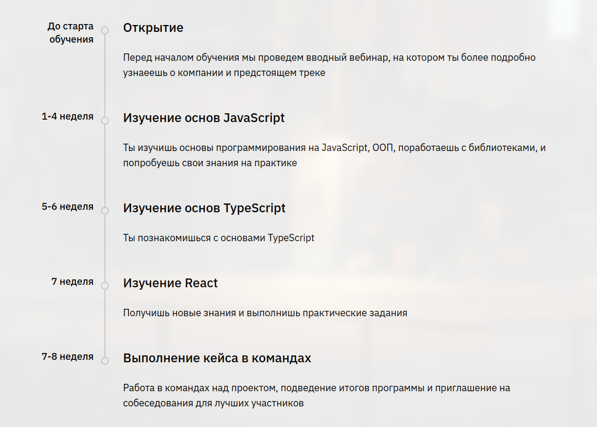
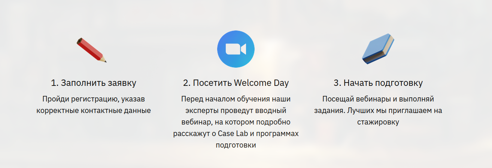

# Unreal Rosatom App

Добрый день! У меня не получилось в полной мере реализовать весь функционал приложения, так как я не смог побороть ошибку CORS, при запросах к directus API (мои попытки это реализовать вы можете видеть в закомментированных строках index.js и docker-compose.yaml)
Я пытался починить ошибку следуя следующим инструкциям (https://www-restack-io.translate.goog/docs/directus-knowledge-directus-cors-error-fix?_x_tr_sl=en&_x_tr_tl=ru&_x_tr_hl=ru&_x_tr_pto=sc&_x_tr_hist=true), но к сожалению у меня не получилось.
По этому я могу представить Вам, только простенький сайтик, который выводит Hello. Но попрошу учесть то, что я смог поднять Directus и nodejs в Docker, Понять как работает React. Если бы я смог исправить ошибку CORS, то я бы смог сделать все остальное. 

Как запустить проект:

```shell
git clone https://github.com/ReveekJ/rosatom_js_test.git
```
```shell
mkdir database
mkdir extensions
mkdir uploads
```
```shell
docker-compose up --build
```

Теперь на localhost:3000 находится сайт с надписью Hello, а на localhost:8055 находится админка Directus. 

## Немного о задании
Я не ожидал задания по той теме, которой я пошел обучаться на этот курс. По Вашей программе:

Я изучаю основы JS, TS, React. 
Но тогда почему для прохождения на обучение я уде должен знать JS. React и другие инструменты, о которых не сказано в программе (например, Docker)?!
К тому же на сайте нигде не указано даже о существовании вступительного, тем более не говориться о том, что нужно знать для поступления на курс:

